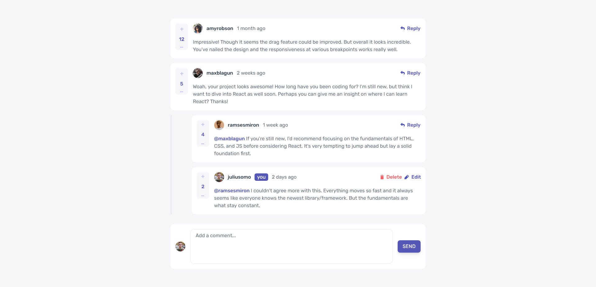

# Frontend Mentor - Interactive comments section solution

This is a solution to the [Interactive comments section challenge on Frontend Mentor](https://www.frontendmentor.io/challenges/interactive-comments-section-iG1RugEG9). Frontend Mentor challenges help you improve your coding skills by building realistic projects. 

## Table of contents

- [Overview](#overview)
  - [The challenge](#the-challenge)
  - [Screenshot](#screenshot)
  - [Links](#links)
- [My process](#my-process)
  - [Built with](#built-with)
  - [What I learned](#what-i-learned)
  - [Continued development](#continued-development)
- [Author](#author)

## Overview

### The challenge

Users should be able to:

- View the optimal layout for the app depending on their device's screen size
- See hover states for all interactive elements on the page
- Create, Read, Update, and Delete comments and replies
- Upvote and downvote comments
- **Bonus**: If you're building a purely front-end project, use `localStorage` to save the current state in the browser that persists when the browser is refreshed.
- **Bonus**: Instead of using the `createdAt` strings from the `data.json` file, try using timestamps and dynamically track the time since the comment or reply was posted.

### Screenshot




### Links

- Solution URL: [GitHub](https://github.com/Sengsith/interactive-comments-section)
- Live Site URL: [Netlify](https://sprightly-dragon-bbf601.netlify.app/)

## My process

### Built with

- Semantic HTML5 markup
- CSS custom properties
- Flexbox
- CSS Grid
- Mobile-first workflow
- [React](https://reactjs.org/) - JS library
- [Tailwind](https://tailwindcss.com/) - CSS Framework

### What I learned

There was so much to this project especially as my first front end CRUD project. Again, this is purely front end so there is no use of servers or node.js and everything is done locally through reading in the JSON file given. This is my first time also using Tailwind, I feel that it would be something I would try to use for smaller projects to get more practice but was too much for me to handle while taking on a bigger project than usual. This is also my first time using local storage:

```js
  useEffect(() => {
    // Check for localStorage first, if nothing then use json file
    const localData = localStorage.getItem('comments');

    (localData !== '[]') ? setComments(JSON.parse(localData)) : setComments(data.comments.sort((a, b) => (a.score < b.score) ? 1 : -1));

  }, []);

  // Every time our comments state changes, sort by score descending
  useEffect(() => {
    comments.sort((a, b) => (a.score < b.score) ? 1 : -1);
    localStorage.setItem('comments', JSON.stringify(comments));
  }, [comments]);
  ```

  I had an issue with it the first time due to it emptying out my comments state and figured out it was due to the app rendering more times than expected during startup due to my App component being wrapped within strict mode.

  There were also many places where I used conditional rendering:

  ```js
  {!isEditing ? <p className="content">{content}</p> 
        : <form className="form-edit" onSubmit={handleOnSubmit}>
            <textarea ref={contentRef} defaultValue={content}/>
            <button className="form-edit-btn">UPDATE</button>
          </form>
  }
  ```

  There is another place where I used ternary operators for this but the else conditional rendered nothing:
  ```js
  {isSameUser ?
  <button className="control-container" onClick={handleClickEdit}>
    
    <div className="edit-text">Edit</div>
  </button>
  : ""}
  ```
  But I believe this can be shortened by just saying:
  ```js
  {isSameUser && {...}}
  ```
  ```{...}``` is where I would like to render what I need, it would make it look slightly cleaner especially since I have these sprinkled around my Comment and Reply components.

### Continued development

While most of the functionality is there, I am still missing persistent score through local storage as I was unsure how to do that without having to edit the JSON file. I was also unsure about how to implement the dynamic timestamp as the instructions were just generally unclear to me. I'm assuming that over time, the date would just change to days, weeks, then years ago depending on how long it was posted. But since the entry within the JSON file was just a string, I wasn't sure what to do. 

I did spend longer than expected on this project and felt that it was finally time to move on. I am still happy with the results of my first CRUD application. 

## Author

- Frontend Mentor - [@Sengsith](https://www.frontendmentor.io/profile/Sengsith)
